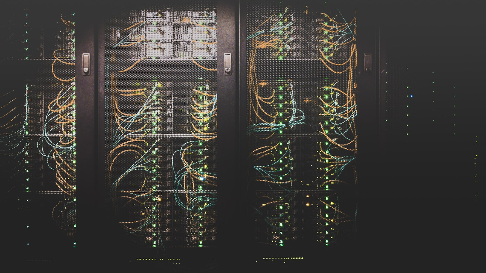

# The Autonomous Planner: What Agentic AI Actually Changes in Retail

*Part 18 of "The Retail Data Playbook" — Season 2 finale*

---

Every retail technology deck you'll see this year promises the same thing: an autonomous, self-healing, agentic supply chain that plans itself while you sleep. RELEX has "Rebot." Blue Yonder has "Pulse AI" micro-services and an Inventory Ops Agent. Oracle's agents write financial revisions back into the system on their own. invent.ai, where I work, has "Remi" — a supervisory agent coordinating specialized agents across forecasting, allocation, replenishment and pricing. Walmart's "Pactum" bots negotiate with a hundred thousand suppliers without a human in the room. The word "agentic" is on every slide.

Some of this is real and already saving money. Some of it is a roadmap wearing a product name. This finale cuts through it with one question: **for the seven decisions we spent this season inside — the budget, the assortment, the two clocks, allocation, replenishment, transfers, the DC — what does agentic AI actually change, what genuinely improves, and what still needs a human?**

*Photo by [Taylor Vick](https://unsplash.com/@tvick) on [Unsplash](https://unsplash.com/).*

---

## Three Levels of "AI," Not One

The first source of confusion is that "AI" in these decks means three very different things, and they're not equally mature:

| Level | What it does | Human's role | Example |
|---|---|---|---|
| **Predictive** | Detects and forecasts — flags an anomaly, predicts demand | Human decides and acts | "This SKU will stock out Thursday" |
| **Generative** | Recommends — proposes a specific action, explains why | Human approves, then acts | "Transfer 200 units A→B; here's the margin math" |
| **Agentic** | Acts — plans, executes, and writes the change back autonomously | Human sets goals and guardrails | Agent reorders, reroutes, and rebalances on its own |

Most retailers today live in predictive and early-generative. The leap everyone is selling is to **agentic** — systems that don't just surface a recommendation and wait, but log into the ERP, place the order, negotiate the freight, and reconcile the result. The gap between "we have AI" and "AI runs this decision" is enormous, and it's exactly where most of the marketing blurs.

The blunt evidence: something like 88% of retailers have adopted AI in some form, but only ~39% report a direct benefit on the income statement. That **implementation gap** is the story of the next few years — and most of it comes from AI that stops at "recommend" and never earns the trust to "act."

---

## Which of the Season's Decisions Get Automated First

Not all seven decisions are equally ready for autonomy. The pattern is clear once you line them up: **the more repetitive, high-frequency, and data-clean the decision, the sooner an agent takes it over. The more strategic, low-frequency, and judgment-laden, the longer a human stays in the loop.**

| Decision (this season) | Automation readiness | Why |
|---|---|---|
| Store replenishment (P15) | **Highest — already largely autonomous** | High-frequency, repetitive, clear reward signal. Auto-approval rates of 95–99.5% are real today. |
| DC replenishment (P17) | High | Same logic, one echelon up; MEIO + demand sensing run continuously. |
| Store transfers (P16) | High | Rules-based profitability test; agents rebalance networks in near real time. |
| Initial allocation (P14) | Medium | Automatable, but the size-curve and cold-start judgment still benefit from oversight. |
| In-season re-trending (P13) | Medium | Signal-vs-noise calls are increasingly agent-driven with human exception review. |
| Assortment (P12) | Lower | Strategic, taste-laden, "science ranks, art decides" — agents assist, humans choose. |
| Financial plan / MFP (P11) | **Lowest — stays human-led** | Sets the company's financial guardrails; low-frequency, high-stakes, board-facing. |

Read that column top to bottom and you have the actual sequence of the autonomous transition: it eats replenishment and transfers first, works its way up through allocation and in-season, and leaves the strategic, once-a-season, money-defining decisions to humans the longest. Anyone promising full autonomy across *all* of it "now" is selling the roadmap, not the product.

---

## What Genuinely Improves

Strip away the hype and there's a real, measurable core. Across the deep-dive research behind this season, the credible wins cluster in a few places:

- **Autonomy on the repetitive tail.** When 95–99% of replenishment orders auto-approve, planners stop rubber-stamping and start managing exceptions. That's a genuine shift in where human hours go — from data entry to judgment.
- **Structural inventory reduction at the same service level.** MEIO and probabilistic models repeatedly deliver ~20–30% less inventory without hurting availability. Not a forecasting gimmick — a network-optimization result.
- **Speed on shocks.** Agents that reroute product across a network within *hours* of a weather event or a viral spike — instead of a planning cycle later — turn the bullwhip from a liability into a reflex.
- **Time reallocation.** The consistent theme across vendors: planners redirect ~50% of the time they spent building plans in spreadsheets toward strategic work. The value isn't the robot; it's what the human does once the robot has the routine.

Notice what all four have in common: the win is almost never "the AI made a better single decision than a person." It's "the AI made ten thousand decent decisions instantly and freed the person for the ten that actually needed a brain."

---

## What Still Needs a Human

The autonomous-planner pitch quietly skips the hard parts. Every one of these is a place where "let the agent handle it" fails, and they map directly onto lessons from this season:

- **Dirty data still poisons everything.** Phantom inventory (Part 15), censored size curves (Part 14), the planning gap between finance and merchandising (Part 11). An agent acting confidently on bad data is *worse* than a human hesitating over it — it executes the mistake at machine speed. Garbage in, autonomous garbage out.
- **Judgment on strategy and taste.** Assortment (Part 12) and the financial plan (Part 11) encode brand identity and risk appetite. "Science ranks, art decides" doesn't disappear when the science gets an agent.
- **Guardrails and human-in-the-loop.** The mature deployments don't unleash agents — they sandbox them: agents act within approval barriers, on bounded budgets, with a human owning the exceptions. Autonomy is earned incrementally, decision by decision, as trust is proven. Remi is explicit about this shape: explainable recommendations rather than black-box output, and controls that let a planner approve, adjust or override an action, scoped by category, region or channel.
- **Change management.** The single most-cited reason these projects fail isn't the algorithm — it's the organization. Roughly 60% of failures trace to workforce resistance, training gaps, and fear, not to bad math. If planners don't trust the agent, they quietly revert to spreadsheets, and the ROI evaporates.

The uncomfortable truth: the bottleneck to the autonomous planner is rarely the AI. It's the data quality, the org design, and the trust — the same three things that were the bottleneck before anyone said "agentic."

---

## What This Means for the Data Scientist

If agents take the routine decisions, is there less for a retail data scientist to do? The opposite. The role shifts up the stack:

1. **From building models to building the systems agents run on.** The metric layer (Season 1), the demand-unconstraining pipeline, the phantom-inventory detector, the MEIO optimizer — agents are only as good as the substrate underneath them. Someone has to build the substrate.
2. **From point predictions to guardrails and objectives.** Agentic systems need well-specified goals ("hold margin above X, service above Y") and safe bounds. Translating messy business intent into an agent's objective function *is* the job.
3. **From reporting to trust engineering.** Explainability, exception design, sandboxing, monitoring for drift — the work that earns an agent the right to act. This is where "the model gets used" (the recurring theme of this whole series) becomes "the agent gets trusted."
4. **From forecasting to the feedback loops that make autonomy learn.** Transfer volume feeding allocation (Part 16), plan-vs-actual memory (Part 13), KPI streams retraining safety stock (Part 15). Autonomy without a learning loop is just fast automation.

The data scientist doesn't get automated away. They move from the person who computes the answer to the person who builds — and governs — the machine that computes ten thousand answers an hour.

---

## Key Takeaways

- **"AI" means three different things** — predictive, generative, agentic — at very different maturity. Most retailers are predictive/generative; agentic is the leap everyone's selling.
- **Mind the implementation gap.** ~88% adopted AI; ~39% see a P&L benefit. The difference is AI that stops at "recommend" versus AI trusted to "act."
- **Autonomy arrives in order.** Replenishment and transfers first (repetitive, clean, high-frequency); assortment and the financial plan last (strategic, judgment-laden). Full autonomy across everything "today" is a roadmap, not a product.
- **The real wins are structural, not magical.** ~20–30% inventory reduction at the same service level, hours-not-cycles shock response, and planners freed from rubber-stamping — not "the AI out-guessed a human on one call."
- **The bottleneck is data, org, and trust — not the algorithm.** Dirty data executed at machine speed is worse than a hesitant human. ~60% of failures are change-management, not math.
- **The data scientist moves up the stack** — from computing answers to building, bounding, and governing the systems that compute them autonomously.

---

## Closing Season 2

Across eight posts, we walked the entire operating machine of a retailer:

1. **The Money Map** — MFP and Open-to-Buy: the budget decided before anyone buys.
2. **Assortment** — choosing what to sell where; breadth, depth, and the cold-start problem.
3. **The Two Clocks** — pre-season vs in-season, and the handoff where value leaks.
4. **Initial Allocation** — the first irreversible bet, and the size-curve trap.
5. **Store Replenishment** — the continuous engine, and phantom inventory.
6. **Store Transfers** — the arbitrage in your network, and the report card it writes.
7. **DC Replenishment** — the engine upstream, MEIO, and the bullwhip.
8. **The Autonomous Planner** — what agentic AI actually changes about all of it.

Season 1 gave you the mental models — why retail is hard and what the metrics mean. Season 2 took you inside the machine those metrics drive. The through-line of both is the same: in retail, the winning data scientist isn't the one with the fanciest model. It's the one who understands the *decision* — who's making it, what it's really optimizing, and what happens when it's wrong — and then builds the system that makes that decision better, faster, and eventually on its own.

That's the whole playbook. Thanks for reading it.

---

*"The Retail Data Playbook" is a series for data scientists and analysts building products for retail and e-commerce businesses. Season 2 went inside the operating machine of a retailer.*

*All company names and data in this series are fictional and used for illustrative purposes.*
