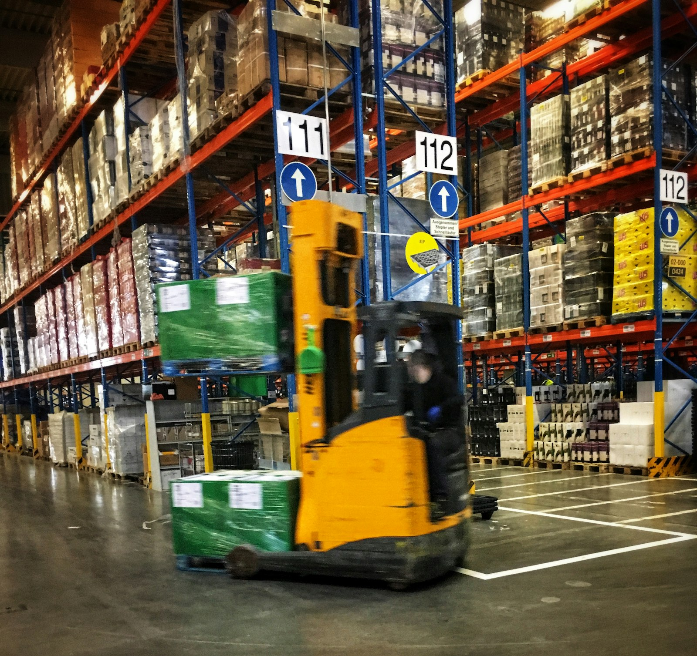

# The Engine Upstream: DC Replenishment & Multi-Echelon Optimization

*Part 17 of "The Retail Data Playbook" — Season 2: Inside the Planning Machine*

---

Every empty shelf has a cause, and it's usually not on the shelf.

When a customer finds a gap where the oat milk should be, the instinct is to look at the store — bad forecast, phantom inventory, slow staff. Sometimes that's it. But just as often the real cause is one or two links up the chain: the distribution center that feeds that store was itself out of stock, or held the wrong buffer, or couldn't turn a supplier pallet around fast enough. The store was always going to run dry; the decision that doomed it happened upstream, days earlier.

This is the last operational post of the season, and it's the one that sits *above* everything we've covered. Allocation, replenishment, transfers — all of them assume the stock exists somewhere in your network to move. **DC replenishment is where that "somewhere" is decided.** Get the distribution center wrong and every downstream model, however clever, is optimizing over an empty tank.

*Photo by [Bernd Dittrich](https://unsplash.com/@hdbernd) on [Unsplash](https://unsplash.com/).*

---

## The Store Is Not an Island: Echelons

A retail supply chain is a stack of **echelons** — supplier → distribution center → store → customer. The critical decision is how you optimize inventory *across* that stack, and there are two philosophies:

- **Single-echelon.** Each level optimizes its own buffer in isolation. Each store sets its own safety stock as if it stood alone; the DC sets its own as if the stores didn't exist. Everyone is blind to everyone else.
- **Multi-Echelon Inventory Optimization (MEIO).** The whole network — supplier, DC, stores — is optimized as one integrated system. MEIO decides *at which nodes and in what quantities* to hold the safety stock needed to hit the target service level, network-wide.

Single-echelon feels safe and is quietly wasteful. Because every node hedges independently, buffers stack on buffers, and the same demand uncertainty gets insured against three times over. MEIO exploits **risk pooling**: variability aggregated at the DC is proportionally smaller than the sum of variability at each store, so the DC can hold far less buffer while the network as a whole gets *more* reliable.

**FreshMart — Safety Stock for One SKU: Single-Echelon vs MEIO (1 DC + 80 stores)**

|                                         | Single-echelon (siloed) | MEIO (network-optimized) |
| --------------------------------------- | ----------------------- | ------------------------ |
| Store safety stock (80 stores combined) | 3,200                   | 2,900                    |
| DC safety stock                         | 2,500                   | 1,200                    |
| **Total network safety stock**          | **5,700**               | **4,100**                |
| Target service level                    | 97.5%                   | 97.5%                    |

Same service level, **~28% less inventory** — and therefore ~28% less tied-up capital and, for fresh, ~28% less spoilage exposure. The saving comes almost entirely from the DC: pooling the stores' aggregated uncertainty into one buffer is dramatically more efficient than making each store carry its own. This is the single biggest structural lever in upstream replenishment, and it's invisible if you only ever look at one echelon at a time.

---

## Taming the Bullwhip

Season 1 [opened the whole series](/blog/why-retail-is-hard/) with the **bullwhip effect** — how a modest 30% swing in consumer demand amplifies into a 120% production swing upstream, then a crash. The DC is exactly where that amplification either gets tamed or gets worse.

Here's the mechanism. In a siloed chain, the DC doesn't see consumer demand — it sees *store orders*. Stores over-order to protect themselves, the DC over-orders to protect itself against the stores, the supplier over-produces to protect against the DC. Each layer adds its own safety margin to a signal that's already distorted, and the wave grows as it travels up. MEIO plus **demand sensing** breaks the cycle by giving every echelon the *true consumer signal* (POS data) instead of the distorted order-flow from the layer below. When the DC plans against real demand rather than panicked orders, the whip stops cracking. Damping the bullwhip is not a forecasting trick — it's an *information-architecture* decision about what each echelon is allowed to see.

---

## DC or Direct: The Routing Decision

Not everything should even go through a DC. The other big upstream choice is **DC replenishment vs. Direct Store Delivery (DSD)** — supplier-to-DC-to-store, or supplier-straight-to-store:

|                      | DC Replenishment                                        | Direct Store Delivery (DSD)                                |
| -------------------- | ------------------------------------------------------- | ---------------------------------------------------------- |
| Purpose              | Consolidation, freight optimization, economies of scale | Speed to shelf, supplier-controlled merchandising          |
| Best for             | Long shelf-life, predictable, high-SKU-variety goods    | Short shelf-life, high-turnover, promotion-sensitive goods |
| Inventory visibility | High central accuracy; dampens bullwhip                 | Better at store level; network balancing is harder         |
| Freight cost         | Lower — consolidated loads                              | Higher — dispersed routing                                 |
| Store workload       | Fewer deliveries, less receiving labor                  | Frequent supplier drops, more receiving labor              |

A centralized DC in a large network typically cuts store-level workload by 15–35% and total trip counts by 25–45% — that's the consolidation payoff. But DSD wins for fresh bread, soft drinks, and anything where a supplier's own van beats waiting a day for the DC. Real retailers run **hybrids**: DC for the ambient long-tail, DSD for fresh and promotional volume. The data scientist's job includes drawing that line per category, not defaulting the whole assortment to one model.

---

## How the DC Actually Turns Stock Around

Two operational concepts decide whether a DC is a fast river or a stagnant pond:

- **Cross-docking.** A supplier pallet is transferred straight from the inbound dock to the outbound dock — never entering storage. It arrives, gets labeled for a store, and leaves. No put-away, no picking, minimal handling.
- **Pick-by-line.** Bulk product arriving from a supplier is split *on arrival* into lanes, one per store — and critically, the split is recalculated against *real-time* store demand at the moment the pallet lands, not the demand forecast from when the order was placed.

Both matter to the data scientist because they're decision points, not just warehouse mechanics. The moment a pallet hits the dock, an algorithm can re-allocate it to the stores that need it *most right now* — prioritizing a store about to stock out over one with a week of cover left. That's demand sensing applied at the last possible second, and it's where a surprising amount of downstream availability is won or lost.

---

## The Scenario: FreshMart's Oat Milk, Two Links Up

Return to the empty oat-milk shelf from Part 15. Downstream, it looked like a phantom-inventory or forecasting problem. But trace it up the chain:

**FreshMart — Oat Milk Stockout, Root-Cause Trace**

| Echelon     | What the data showed                   | Real cause                                                       |
| ----------- | -------------------------------------- | ---------------------------------------------------------------- |
| Store shelf | Empty; system thought 12 units on hand | Phantom inventory (Part 15) — *plus* no replenishment inbound    |
| Store order | Reorder fired late, small quantity     | DC couldn't fully fill it                                        |
| DC          | Out of stock on oat milk for 2 days    | DC safety stock set single-echelon, too thin for a demand spike  |
| Supplier    | On time, but DC ordered late           | DC planned against store orders, not consumer POS — bullwhip lag |

The shelf gap wasn't one failure; it was a *chain* of them, and the biggest lever was two echelons up: a DC buffer set in isolation, replenished off distorted order-flow instead of true demand. Fix the store alone and it stocks out again next month. Fix the DC — MEIO buffer, demand-sensed ordering, cross-dock prioritization — and the whole branch of the network downstream of it gets healthier at once. **Upstream fixes have leverage; downstream fixes have reach only as far as the next empty tank.**

---

## What the Data Scientist Actually Builds

1. **A multi-echelon optimizer.** Stop setting store and DC safety stock separately. Solve the network as one system — where to hold buffer, how much, to hit the service target at minimum total inventory. This is the highest-leverage model in upstream replenishment.
2. **Demand-sensed DC planning.** Plan the DC against *consumer* POS signals, not the store order-flow that layers bullwhip distortion on top. The information architecture matters as much as the algorithm.
3. **Dynamic DC safety stock.** Recompute per SKU daily from live volatility and supplier lead-time *distributions* — not static percentages. (Same probabilistic principle as Part 15, one echelon up.)
4. **A cross-dock / pick-by-line allocator.** At the moment a pallet lands, re-split it across stores by current demand and stockout risk, not the stale forecast that placed the order.
5. **A DC-vs-DSD classifier.** Recommend the routing model per category based on shelf life, turnover, and promotion sensitivity — and quantify the freight-vs-speed trade-off instead of defaulting everything to the DC.

Anchor it on the right KPIs: **fill rate** (did the DC fully serve store orders?), **order cycle time** (decision-to-shelf), **DC-to-store shipment accuracy**, and network inventory turnover. Fill rate is the one to watch — a DC quietly missing store orders is the upstream signature of the downstream empty shelf.

---

## Key Takeaways

- **Most empty shelves are decided upstream.** The store often can't win a battle the DC already lost days earlier. Fix causes at the echelon that owns them.
- **Optimize the network, not the node.** Single-echelon buffers stack waste; MEIO exploits risk pooling to hold ~25–30% less inventory at the same service level — mostly by shrinking the DC buffer.
- **The DC is where the bullwhip is tamed or amplified.** Plan against true consumer demand (POS), not the distorted order-flow from below. It's an information-architecture choice.
- **DC vs. DSD is a per-category decision.** Consolidate the predictable long-tail through the DC; route fresh and promotional volume direct. Hybrids win.
- **Cross-docking and pick-by-line are decision points.** Re-allocate pallets to real-time demand the moment they land — last-second demand sensing wins downstream availability.
- **Watch fill rate.** A DC quietly under-serving store orders is the hidden upstream cause of the visible downstream stockout.

---

## What's Next

That completes the operating machine: money (Part 11), assortment (12), the two planning clocks (13), allocation (14), store replenishment (15), transfers (16), and the DC engine upstream (17). Every one of these decisions is now being handed, piece by piece, to autonomous systems. So in the Season 2 finale, Part 18, we step back and ask the question every vendor deck is shouting about: **[what does agentic AI actually change](/blog/agentic-ai/)** about the planning machine — which of these decisions get automated first, what genuinely improves, and what still needs a human in the loop?

---

*"The Retail Data Playbook" is a series for data scientists and analysts building products for retail and e-commerce businesses. Season 2 goes inside the operating machine of a retailer.*

*All company names and data in this post are fictional and used for illustrative purposes.*