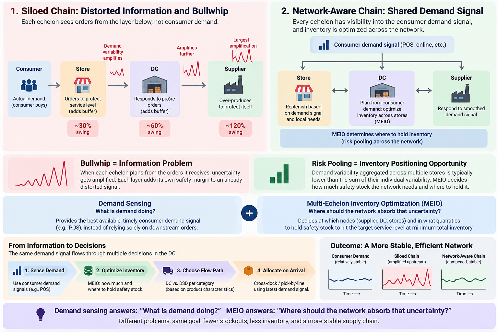

*Part 17 of "The Retail Data Playbook" — Season 2: Inside the Planning Machine*

---

Every empty shelf has a cause, and it's usually not on the shelf.

When a customer finds a gap where the oat milk should be, the instinct is to look at the store — bad forecast, phantom inventory, slow staff. Sometimes that's it. But just as often, the real cause is further upstream. The distribution center feeding the store may have been out of stock, held the wrong safety buffer, or failed to process an inbound supplier shipment quickly enough. The store was always going to run dry; the decision that caused the problem had been made upstream, days earlier.

This is the last operational post of the season, and it's the one that sits *above* everything we've covered. Allocation, replenishment, transfers — all of them assume the stock exists somewhere in your network to move. **DC replenishment is where that "somewhere" is decided.** Get the distribution center wrong and every downstream model, however clever, is optimizing over an empty tank.

*Photo by [Bernd Dittrich](https://unsplash.com/@hdbernd) on [Unsplash](https://unsplash.com/).*

---

## The Store Is Not an Island: Echelons

A retail supply chain is a network of interconnected echelons: supplier → distribution center → store → customer. The real challenge is deciding how to position inventory across that network.

- **Single-echelon.** Each level optimizes its own buffer in isolation. Each store sets its own safety stock as if it stood alone; the DC sets its own as if the stores didn't exist. Each node makes its own decision without seeing the inventory position of the network around it.
- **Multi-Echelon Inventory Optimization (MEIO).** The network is optimized as an integrated system rather than as a collection of independent nodes. MEIO decides *at which nodes and in what quantities* to hold the safety stock needed to hit the target service level, network-wide.

Single-echelon feels safe and is quietly wasteful. Because every node hedges independently, buffers stack on buffers, and the same underlying demand variability is buffered independently at multiple nodes. MEIO exploits **risk pooling**: variability aggregated at the DC is proportionally smaller than the sum of variability at each store, so the DC can hold far less buffer while the network as a whole gets *more* reliable.

**FreshMart — Safety Stock for One SKU: Single-Echelon vs MEIO (1 DC + 80 stores)**

|                                         | Single-echelon (siloed) | MEIO (network-optimized) |
| --------------------------------------- | ----------------------- | ------------------------ |
| Store safety stock (80 stores combined) | 3,200                   | 2,900                    |
| DC safety stock                         | 2,500                   | 1,200                    |
| **Total network safety stock**          | **5,700**               | **4,100**                |
| Target service level                    | 97.5%                   | 97.5%                    |

Same target service level, ~28% less network safety stock — and potentially less tied-up capital and, for fresh products, lower spoilage exposure. Most of the reduction comes from the DC: 1,300 of the 1,600 units saved come out of the DC buffer. MEIO pools the stores’ demand variability into a shared upstream buffer instead of making each store hedge independently. This is one of the most important structural levers in upstream replenishment — and it’s invisible if you only ever look at one echelon at a time.

---

## Taming the Bullwhip

Season 1 [opened the whole series](/blog/why-retail-is-hard/)  with the **bullwhip effect** — how a modest 30% swing in consumer demand can amplify into a 120% production swing upstream, followed by a crash. The DC is exactly where that amplification can either be dampened or amplified further.

Here’s the mechanism. In a siloed chain, the DC plans from *store orders*, not directly from consumer demand. Stores increase orders to protect their service levels; the DC responds to those orders, the supplier responds to the DC, and each layer adds its own safety margin to a signal that is already distorted. The wave grows as it travels upstream.

**MEIO** and **demand sensing** attack different parts of this problem. MEIO determines where inventory should absorb variability across the network; demand sensing gives each echelon visibility into the underlying consumer demand signal rather than relying solely on the amplified order-flow from the layer below. When the DC plans against consumer demand rather than amplified store orders, the whip stops cracking.

Damping the bullwhip is not just a forecasting trick — it’s an *information-architecture* decision about which demand signal each echelon plans against.

But inventory positioning is only one of the DC's decisions. The next question is more fundamental: **does the product need to go through the DC at all?**

---

## DC or Direct: The Routing Decision

Not everything should even go through a DC. The other big upstream choice is **DC replenishment vs. Direct Store Delivery (DSD)** — supplier-to-DC-to-store, or supplier-straight-to-store:

| Dimension            | DC Replenishment                                           | Direct Store Delivery (DSD)                                       |
| -------------------- | ---------------------------------------------------------- | ----------------------------------------------------------------- |
| Purpose              | Consolidation, freight optimization, economies of scale    | Speed to shelf, supplier-controlled merchandising                 |
| Best for             | Long shelf-life, predictable, high-SKU-variety goods       | Short shelf-life, high-turnover, promotion-sensitive goods        |
| Inventory visibility | Centralized inventory visibility; easier network balancing | More direct store-level visibility; harder network-wide balancing |
| Freight cost         | Often lower — consolidated loads                           | Often higher — dispersed supplier deliveries                      |
| Store workload       | Fewer deliveries, less receiving labor                     | More frequent supplier drops, higher receiving workload           |

A centralized DC can significantly reduce store-level receiving workload and delivery frequency through consolidation. But DSD can be preferable for fresh products, high-turnover categories, and supplier-controlled promotional activity where speed and direct execution matter.

Real retailers often use **hybrids**: DC for the ambient long-tail, DSD for fresh and promotion-sensitive volume. The data scientist's job includes drawing that line per category, not defaulting the whole assortment to one model.

---

## How the DC Actually Turns Stock Around

Two operational concepts help determine whether a DC is a fast river or a stagnant pond:

- **Cross-docking.** A supplier pallet is transferred straight from the inbound dock to the outbound dock — without being put away into storage. It arrives, gets identified or labeled for its destination, and moves on. No put-away, minimal storage, and minimal handling.
- **Pick-by-line.** Product is organized and picked by store or order line rather than being put away and later picked from storage. In a demand-sensed operation, the allocation can also be recalculated as inventory arrives, allowing the DC to redirect scarce product toward stores with the greatest immediate need.

Both matter to the data scientist because they create decision points, not just warehouse mechanics. When a pallet lands, an algorithm can re-allocate available inventory toward the stores that need it most — prioritizing a store at risk of stockout over one with a week of cover left.

That's demand sensing applied at the latest practical decision point, and it can materially improve downstream availability.

---

## The Scenario: FreshMart's Oat Milk, Two Links Up

Return to the empty oat-milk shelf from Part 15. Downstream, it looked like a phantom-inventory or forecasting problem. But tracing it up the chain reveals a series of connected issues:

**FreshMart — Oat Milk Stockout, Root-Cause Trace**

| Echelon     | What the data showed                   | Real cause                                                                                                        |
| ----------- | -------------------------------------- | ----------------------------------------------------------------------------------------------------------------- |
| Store shelf | Empty; system thought 12 units on hand | Phantom inventory (Part 15) — **plus** no replenishment inbound                                                   |
| Store order | Reorder fired late, small quantity     | DC couldn't fully fill it                                                                                         |
| DC          | Out of stock on oat milk for 2 days    | DC safety stock was set in isolation and was too thin for the demand spike                                        |
| Supplier    | On time, but DC ordered late           | DC planned from downstream store orders rather than the underlying consumer demand signal — creating bullwhip lag |

The shelf gap wasn't one failure; it was a **chain** of them. And the biggest structural lever was two echelons up: a DC buffer set in isolation, with replenishment decisions driven by distorted downstream orders rather than the underlying consumer demand signal.

Fix the store alone and the problem can recur. Fix the DC at all three levels — **where inventory is held, what signal drives replenishment, and how arriving inventory is allocated** — and the improvement can propagate downstream.

**Upstream fixes have leverage; downstream fixes have reach only as far as the next empty shelf.**

---

## What the Data Scientist Actually Builds

The data scientist working on DC replenishment isn't building one forecast. They're building a set of decisions around **inventory, information, routing, and flow**:

1. **A multi-echelon optimizer.** Stop setting store and DC safety stock independently. Solve the network as one system — deciding where to hold buffer and how much is needed to hit the target service level at minimum total inventory. This turns replenishment from independent node-level decisions into a network optimization problem.
2. **Demand-sensed DC planning.** Plan the DC using the best available consumer-demand signals, including POS, rather than relying solely on downstream store orders. The information architecture matters as much as the forecasting algorithm.
3. **Dynamic DC safety stock.** Recompute per-SKU safety stock from recent demand variability and supplier lead-time distributions rather than applying static percentage rules. The same probabilistic principle used at the store level now applies one echelon upstream.
4. **A cross-dock / dynamic-allocation engine.** When a pallet arrives, re-allocate available inventory across stores using the latest demand signal and stockout risk rather than relying entirely on the forecast that placed the original order.
5. **A DC-vs-DSD classifier.** Recommend the routing model per category based on factors such as shelf life, demand velocity, supplier lead time, and promotion sensitivity — and quantify the freight-versus-speed trade-off instead of defaulting everything to the DC.

Anchor it on the right KPIs: **fill rate** (how much of store demand the DC actually fulfilled), **order cycle time** (decision-to-shelf), **DC-to-store shipment accuracy**, and **network inventory turnover**.

Fill rate is one of the most revealing signals: a DC quietly under-serving store demand can be an upstream signature of downstream stockouts.

---

## Key Takeaways

- **Most empty shelves are decided upstream.** The store often can't win a battle the DC already lost days earlier. Fix the cause at the echelon that owns it.
- **Optimize the network, not the node.** Single-echelon buffers can stack unnecessarily; MEIO uses risk pooling to decide how much safety stock the network needs and where to hold it. In the example above, that cuts network safety stock by **~28% at the same target service level**.
- **The DC is where the bullwhip can be dampened or amplified.** Plan from the best available consumer-demand signal rather than relying solely on distorted downstream order-flow. It's an information-architecture decision as much as a forecasting one.
- **DC vs. DSD is a per-category decision.** Consolidate suitable long-tail volume through the DC; use direct delivery where freshness, speed, supplier execution, or promotional cadence make it advantageous. Most large networks use a combination.
- **Cross-docking and dynamic allocation are decision points.** When inventory arrives, allocation can be adjusted using the latest demand signal and stockout risk rather than relying entirely on the forecast that placed the original order.
- **Watch fill rate — but don't watch it alone.** A DC quietly under-serving store demand can be an upstream signal of downstream stockouts.

---

## What's Next

That completes the operating machine: money (Part 11), assortment (12), the two planning clocks (13), allocation (14), store replenishment (15), transfers (16), and the DC engine upstream (17). Every one of these decisions is now being handed, piece by piece, to autonomous systems. So in the Season 2 finale, Part 18, we step back and ask the question every vendor deck is shouting about: **[what does agentic AI actually change](/blog/agentic-ai/)** about the planning machine — which of these decisions get automated first, what genuinely improves, and what still needs a human in the loop?

---

*"The Retail Data Playbook" is a series for data scientists and analysts building products for retail and e-commerce businesses. Season 2 goes inside the operating machine of a retailer.*

*All company names and data in this post are fictional and used for illustrative purposes.*