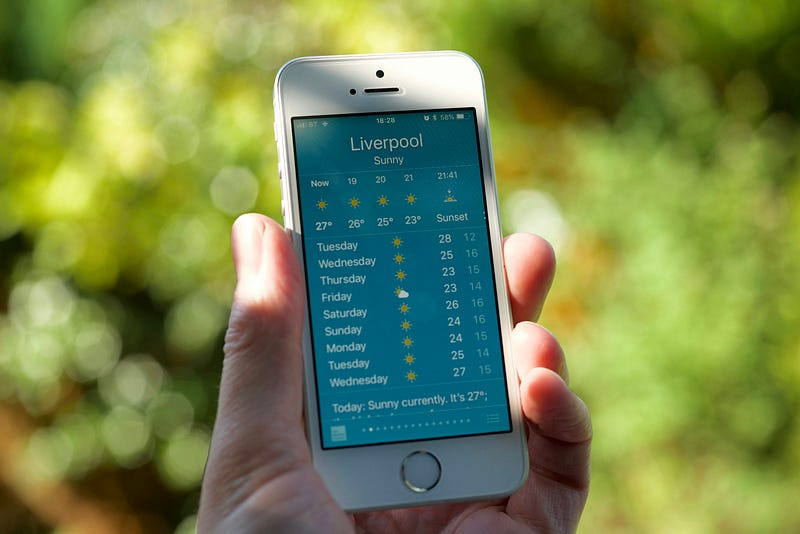

*Part 7 of "The Retail Data Playbook"*

---

A quant from a hedge fund once told me he was thinking about moving into retail data science. "How hard can forecasting be?" he said. "You've got years of POS data. At least the signal is real — unlike derivatives pricing."

Six months later he called me. "Nobody told me that 30% of my training data is censored," he said. "And that a TikTok video can make my best model useless overnight."

Retail forecasting is hard in ways that aren't obvious from the outside. The data looks rich — millions of transactions, years of history, granular SKU-level detail. But the problems embedded in that data are subtler and more damaging than anything you'd face in most other domains.



*Photo by [Gavin Allanwood](https://unsplash.com/@fp4) on [Unsplash](https://unsplash.com/).*

---

## Why Every Retail Decision Starts With a Forecast

Before we get to the hard parts, let's be clear about what's at stake.

Demand forecasting isn't an academic exercise in retail. Every operational decision is downstream of it:

- **Buying:** How many units of the Cleo Wrap Dress should TrendCo order for Spring? Based on a demand forecast.
- **Replenishment:** How much yogurt should FreshMart order for Wednesday? Based on a demand forecast.
- **Allocation:** Which stores should get more of the Nova Blazer? Based on a store-level demand forecast.
- **Markdowns:** When should TrendCo cut the price on the Satin Midi Skirt? Based on a projected final STR — which is a demand forecast.
- **Safety stock:** How much buffer inventory does FreshMart need? Based on the *error* in the demand forecast.

The cascade matters. A 5% improvement in forecast accuracy doesn't just make the forecast team feel better — it reduces safety stock (freeing capital), reduces stockouts (capturing more revenue), and reduces markdown spend (protecting margin). At scale, across thousands of SKUs, this compounds into tens of millions in impact.

---

## The Three Forecasting Problems Retail Throws at You

### Problem 1: New Products With No History

**Fashion version:** TrendCo's Spring 2026 collection includes 180 new styles. Not one of them has a single day of sales history. The buyer needs a demand forecast — or at minimum, a buying quantity — for each of them, to be placed with suppliers 6 months before selling begins.

This is the defining forecasting challenge in fashion. And it's a genuinely hard problem.

You can't use time series methods — there's no series. You can't use collaborative filtering — there are no ratings or interactions. What you can do:

**Look-alike matching:** Find past products most similar to the new style by attributes — price tier, silhouette, fabric type, color palette, brand tier. Use their demand pattern as a prior.

**Attribute-based models:** Train a model on historical products using their attributes as features (price, color, fit, trend category, season) and their actual sell-through as the label. Apply this model to predict the new product's expected STR before it launches.

**Early signal detection:** The most powerful tool isn't the pre-launch forecast — it's how quickly you update it once the product hits stores. Even 1–2 weeks of real sales data can dramatically sharpen the picture. A product tracking 50% above similar styles in Week 2 isn't just "doing well" — it's a signal to chase (reorder, rebalance allocation). A product tracking 40% below is a brokenness candidate to investigate before the season locks in.

**FreshMart version:** Grocery has its own version of this. A new product launch — a new beverage flavor, a new private label SKU — has no history either. But the fix is slightly easier: you have comparable products in the same category with stable demand patterns. The challenge is nailing the promotional uplift for the launch period, not the ongoing baseline.

---

### Problem 2: Promotions Break Your Baseline

**The FreshMart problem:** Yogurt normally sells 20 units per day per store. This week it's on promotion — 2-for-1. It sells 68 units per day. Next week, after the promotion ends, it sells 9 units per day.

Three questions your model needs to answer correctly:

1. How much of the 68 units was real incremental demand (new customers, more consumption)?
2. How much was **pantry loading** — customers buying 6 weeks of yogurt in one trip, which depresses the next 3–5 weeks of sales?
3. What is the "true" baseline — what would have sold without any promotion?

If your model mistakes the promotional spike for a trend signal, it will forecast 50+ units for the following weeks, causing FreshMart to massively overorder and then scramble to manage surplus stock when demand collapses post-promotion.

**The FreshMart mock data:**

**Yogurt 500g — Weekly Sales (FreshMart, per store)**

| Week | Units Sold | Promotion | Notes |
|------|-----------|-----------|-------|
| Wk 1 | 20 | None | Baseline |
| Wk 2 | 21 | None | Baseline |
| Wk 3 | 19 | None | Baseline |
| Wk 4 | 68 | 2-for-1 | Promotional spike |
| Wk 5 | 9 | None | Post-promo dip (pantry load) |
| Wk 6 | 11 | None | Still recovering |
| Wk 7 | 18 | None | Back to baseline |
| Wk 8 | 20 | None | Baseline |

A naive model trained on Weeks 1–4 (if it doesn't see the promo flag) might forecast 35 units for Week 5. Reality: 9.

**The fix:** Always model promotional and non-promotional periods separately. Your baseline model predicts what demand would be at regular price. Your promotion model estimates *lift* — the incremental uplift from the promotion — which must be added to baseline during the promotional window and subtracted in the post-promo dip window.

This is why the promotion calendar is one of the most critical data assets in grocery retail. If it's wrong, or incomplete, or updated with last-minute changes that don't get recorded — your baseline demand estimates are permanently contaminated.

---

### Problem 3: Demand Censoring — The Vicious Cycle

This is the subtlest and most damaging problem in retail forecasting. Most data scientists miss it until they're knee-deep in it.

**What is demand censoring?**

When FreshMart's yogurt shelf is empty for two days, the POS system records zero sales. But zero sales doesn't mean zero demand. There were customers who wanted yogurt, didn't find it, and left or substituted. That latent demand — the demand that *would have* occurred if stock had been available — is invisible in the data.

The demand is "censored" at zero by the stockout.

**Why it creates a vicious cycle:**

```
Product runs out → POS records zero sales for OOS days
                 ↓
Forecast model trained on POS → "demand was low those days"
                 ↓
Forecast is understated → Order quantity is reduced
                 ↓
Less safety stock ordered → Product stocks out more frequently
                 ↓
More OOS days → More censored zeros → Forecast even lower
                 ↓
Cycle continues until product becomes permanently underforecast
```

**The FreshMart censoring example:**

| Week | True Demand | Units Sold | OOS Days | POS Records | Model Sees |
|------|------------|-----------|----------|-------------|------------|
| Wk 1 | 140 | 140 | 0 | 140 | 140 |
| Wk 2 | 138 | 138 | 0 | 138 | 138 |
| Wk 3 | 143 | 120 | 2 days | 120 | 120 ← understated |
| Wk 4 | 141 | 98 | 3 days | 98 | 98 ← understated |
| Wk 5 | 139 | 80 | 4 days | 80 | 80 ← understated |
| **Avg** | **140.2** | **115.2** | — | **115.2** | **115.2** |

The model's estimated baseline: **115 units/week**. True baseline: **140 units/week**. Forecast error: 18% systematic underestimate — from censoring alone, not from any model failure.

FreshMart orders based on 115. True demand is 140. They stock out again next week. The cycle continues.

**How to fix it:**

There are four practical approaches, each suited to different situations:

| Situation | Method | How it works |
|-----------|--------|-------------|
| OOS is rare (<5% of periods) | Proportional uplift | `True demand ≈ Recorded sales × (Total periods / In-stock periods)` |
| OOS follows a pattern (always on weekends, delivery days) | Comparable period substitution | Use sales from the same day-of-week when in stock as the estimate |
| OOS is frequent and demand is non-uniform | Tobit regression | Models latent demand statistically, treating OOS periods as right-censored observations |
| Clear substitutes exist (Cola A → Cola B, Size M → Size L) | Substitute demand attribution | Track demand redirection to substitutes; attribute back to OOS product |

**The proportional uplift, demonstrated:**

Week 3: 5 in-stock days, 2 OOS days. Sales: 120 units.
```
Estimated true demand = 120 × (7 / 5) = 168 units
```

Is 168 the right answer? Not perfectly — weekends drive more sales than weekdays, so the two OOS days matter more if they fell on a Saturday. But 168 is far better than 120 as a training signal for the forecast model.

The key point: **fix censored demand before training any model.** A better algorithm trained on censored data will still underforecast. A simpler model trained on corrected data will consistently outperform it.

---

## Choosing the Right Method for the Right Problem

Not every forecasting problem calls for a gradient-boosted transformer with 200 features. Here's a practical method selection guide:

**Retail Forecasting Method Selection**

| Situation | Recommended Method | Why |
|-----------|-------------------|-----|
| Stable grocery SKU, 3+ years of history | Exponential smoothing (Holt-Winters) | Simple, interpretable, hard to overfit; handles seasonality well |
| Grocery SKU with strong promo effects | ARIMAX or gradient boosting with promo features | Promotions need explicit modelling; external features require ML or ARIMAX |
| Fashion style with 2–3 comparable past seasons | Historical curve analogy + early signal update | Not enough history for time series; use curve shape, calibrate with actuals |
| New fashion style, no history | Attribute-based look-alike | Extract demand signal from product attributes, price tier, category |
| New fashion style, Week 2 of selling | Look-alike prior + actual data weighting | Real data starts to dominate; update daily or weekly |
| End-of-season / clearance | STR-based projection | Demand is driven by markdown depth, not trend; time series models fail here |
| Any product, promotional period | Separate lift model on top of baseline | Never model promo and non-promo periods together |

**Start simple.** For the majority of stable grocery SKUs, exponential smoothing outperforms complex models — not because the complex models are bad, but because simpler models are harder to overfit and easier to maintain. Complexity should be earned by demonstrable improvement on a held-out test set, not assumed from the beginning.

---

## The Safety Stock Connection: Why Forecast Accuracy Is a Financial Number

Most people think of forecast accuracy as a model quality metric. It's actually a balance sheet metric.

Safety stock — the buffer inventory held to absorb demand uncertainty — is directly sized by forecast error:

```
Safety Stock = z × σ_demand × √(Lead Time)
```

Where:
- **z** = service level factor (1.65 for 95% service level; 2.33 for 99%)
- **σ_demand** = standard deviation of your forecast error per period
- **Lead Time** = supplier lead time in the same time units

**FreshMart's Yogurt — Safety Stock Under Different Forecast Accuracy Scenarios**

| Forecast Accuracy | σ_demand (units/week) | Lead Time | Service Level | Safety Stock | Capital Tied Up (@ £1.19/unit) |
|------------------|----------------------|-----------|---------------|-------------|-------------------------------|
| Current (censored data) | 28 | 2 weeks | 95% | 65 units | £77 per store |
| After censoring fix | 18 | 2 weeks | 95% | 42 units | £50 per store |
| After censoring + promo model | 12 | 2 weeks | 95% | 28 units | £33 per store |

Across FreshMart's 80 stores, the improvement from fixing censoring and adding a proper promo model reduces safety stock for this one SKU from ~5,200 units to ~2,240 units — a **£3,524 reduction in working capital** for one yogurt SKU.

Scale that across 3,000 active SKUs and the financial impact of better forecasting becomes obvious. This is why CFOs care about forecast accuracy: it directly unlocks working capital that would otherwise sit on shelves.

---

## The TikTok Problem: When History Is Useless

There's one more forecasting challenge worth naming honestly: **demand shocks from social media**.

A TikTok video goes viral featuring TrendCo's Cleo Wrap Dress. In 48 hours, searches for the dress spike 800%. Online sales jump 400%. Stores in London and Manchester sell out in a weekend.

No historical model catches this. The product's week-on-week velocity had been stable. The STR curve was tracking normally. Then a creator with 4 million followers wore it to Ascot.

**What can you do?**

- **Real-time POS monitoring:** Flag styles with abnormal velocity spikes within 24–48 hours of occurrence. "This style sold 3.2× its expected volume in the last 2 days" is an actionable signal even without knowing the cause.
- **Social listening integration:** Connect social media mention velocity and sentiment scores to your demand signal layer. A sudden spike in TikTok mentions of a style — especially from large accounts — is a leading indicator of demand.
- **Safety stock for trend-sensitive SKUs:** For styles that the buying team identifies as "viral potential" (bold designs, collaborations, influencer partnerships), carry higher safety stock from launch. The cost of excess stock on a non-viral product is modest; the cost of stocking out on a viral moment is enormous.
- **Accept imperfection:** Some demand shocks are unforecastable. The goal is to detect them fast enough to respond — not to predict them in advance.

---

## Key Takeaways

- **Every retail decision starts with a forecast.** Buying, replenishment, allocation, markdowns, safety stock — all downstream of demand estimates. A 5% improvement in accuracy cascades into meaningful financial outcomes.
- **New products require attribute-based methods.** Time series doesn't work without history. Use look-alike matching, attribute models, and early signal detection.
- **Promotions must be modelled separately.** A promotional spike isn't a trend. Pantry loading creates post-promo dips. Failure to separate promo from baseline contaminates every forecast you'll ever build.
- **Demand censoring is the most insidious problem.** OOS periods record zero sales, not zero demand. Training models on censored data creates a self-reinforcing underforecast cycle. Fix the data before improving the model.
- **Forecast accuracy is a balance sheet metric.** Every unit of σ_demand reduction translates to lower safety stock and freed working capital. Make this case to business stakeholders — it lands better than RMSE.
- **Social media demand shocks are unforecastable; detection speed is the lever.** Real-time POS monitoring catches viral moments faster than any predictive model.

---

## What's Next

In Part 8, we tackle what feels like the opposite problem: not understock, but overstock. Why do retailers keep ordering too much even when they know it leads to markdowns? What's the right amount of safety stock — and how do you balance service level against capital efficiency? And why is "just order more to be safe" almost always the wrong answer?

---

*This post is part of "The Retail Data Playbook: What They Don't Teach You in Data Science School" — a series for data scientists and analysts building products for retail and e-commerce businesses.*

*All company names and data in this post are fictional and used for illustrative purposes.*
