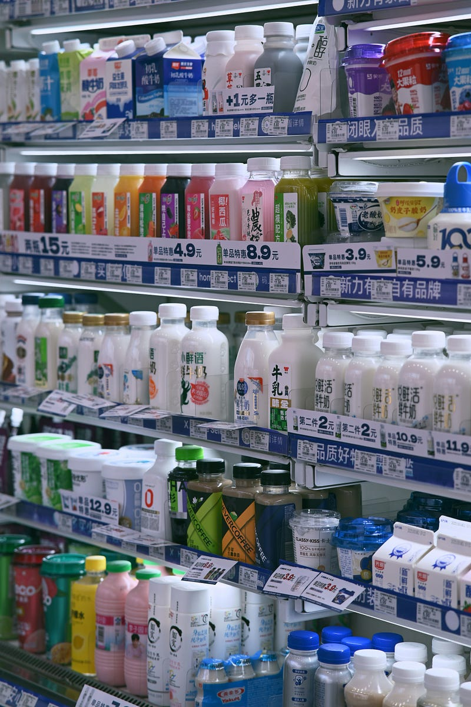

*Part 5 of "The Retail Data Playbook"*

---

When I tell people I work in retail data science, the mental image they usually jump to is one of two things: a supermarket shelf, or a clothing rack. Both are retail. Both involve buying products and selling them to customers. That's roughly where the similarity ends.

Grocery and fashion are so structurally different that a data scientist who's excellent at one can be genuinely lost in the other — not because the technical skills don't transfer, but because the *business logic* is almost entirely different. The metrics, the failure modes, the stakeholder incentives, the data problems — nearly all of it changes when you cross the line between perishables and apparel.

This post is for anyone who's about to enter one of these worlds, or who works with both and wants a clear mental map of how they diverge.



*Photo by [Bruce](https://unsplash.com/@huhexian) on [Unsplash](https://unsplash.com/).*

---

## Two Companies, Two Universes

**TrendCo** — mid-tier UK fashion brand, 120 stores. Orders Cleo Wrap Dresses in September for a February delivery. If the dress doesn't sell, it sits. No second buy. Marked down in April, clearanced in June, gone.

**FreshMart** — regional UK grocery chain, 80 stores. Orders  yogurt from its supplier on Monday; yogurt arrives Wednesday; if it doesn't sell by Sunday, it's written off. Orders more on Monday. Repeat every week, forever.

Let's break down exactly what makes these two businesses so different — and what that means for the data scientist sitting inside each one.

---

## The Fundamental Difference: When Is the Bet Made?

**Fashion: One Bet, No Takebacks**

TrendCo's buyer commits to 18,000 units of a blazer in October. The blazer arrives in January. It will either sell — or it won't. If it doesn't, there's no returning it to the supplier, no swapping it for something that works better. The buyer can only markdown, transfer, or donate.

This is the defining structural feature of fashion retail: **the buying decision is made once, months in advance, under deep uncertainty, and it is essentially irreversible.**

Every piece of fashion data science flows from this: STR tracking, markdown optimization, size curve refinement, demand forecasting for the next season's buying — it all exists to help make that upfront bet smarter, or to manage the consequences when the bet doesn't pay off.

**Grocery: Continuous Bets, Constantly Updated**

FreshMart doesn't make one yogurt decision for the year. It makes a yogurt decision every week — adjusting quantities based on current sales, upcoming promotions, seasonality, shelf life constraints, and supplier lead times.

This is **continuous replenishment**, and it changes everything. Grocery mistakes are smaller and more correctable. Overbought this week? Order less next week. Ran out? Order more. The feedback loop is tight — days, not months.

The flip side: there's no forgiveness for true stockouts in grocery. A customer who can't find their yogurt brand doesn't come back Thursday. They substituted at the shelf — or switched to a competitor.

---

## The Side-by-Side Comparison

**TrendCo (Fashion) vs. FreshMart (Grocery) — Core Operating Parameters**

| Dimension | TrendCo (Fashion) | FreshMart (Grocery) |
|-----------|------------------|---------------------|
| Buying cycle | Pre-season, 4–8 months ahead | Continuous, days to weeks |
| Product life | Seasonal (20–30 weeks) | Perishable (days to weeks) |
| Second chances | Almost never | Weekly — just reorder |
| Assortment breadth | Hundreds of styles × sizes × colors | Thousands of SKUs, stable assortment |
| Key failure mode | Overstock → markdowns | Stockout → lost sale + waste |
| Primary KPI | Sell-Through Rate (STR) | On-Shelf Availability (OSA) |
| Secondary KPI | Weeks of Supply (WOS) | Waste % |
| Promotion role | Occasional, seasonal | Central — 10–45% of revenue |
| Data science lever | Allocation, size curves, markdown timing | Replenishment, promotion effectiveness |

---

## Failure Mode: Fashion vs. Grocery

The failure modes are almost mirror images of each other.

**Fashion failure: the overbought style**

TrendCo's buyer ordered 5,000 units of a satin midi skirt inspired by a runway trend. By Week 6, STR is 28% — the trend didn't land with their customer. 3,600 units remain. Options:
- Take a 35% markdown now, recover some margin, clear by season end
- Hold and hope (risky — clearance markdowns will be deeper)
- Move to outlet channel (margin is nearly zero, but inventory clears)

The buyer is absorbing a buying mistake made 7 months ago. No amount of good data science can un-ring this bell — but better forecasting and tighter test-and-reorder discipline can make these mistakes rarer and less severe.

**Grocery failure: the empty shelf**

FreshMart's replenishment system had an error — a supplier lead time changed and the reorder trigger wasn't updated. For 3 days, the  yogurt shelf in 12 stores was empty.

Lost sales: ~180 units × 3 days × 12 stores = ~6,480 units × £1.20 margin = **£7,776 in lost margin**. Plus: some of those customers found an alternative yogurt brand. Some of them liked it. Brand loyalty erosion is harder to quantify — but very real.

**The asymmetry:**

| | Fashion (TrendCo) | Grocery (FreshMart) |
|-|-------------------|---------------------|
| Biggest financial risk | Overstock / markdowns | Stockout / lost sales |
| Time to detect problem | Weeks (STR trending wrong) | Days (shelf scan / POS data) |
| Correction speed | Slow (markdown, transfer) | Fast (reorder next cycle) |
| Forgiveness | Low — season passes | Medium — restock and carry on |

---

## The Metrics Couldn't Be More Different

In TrendCo's Monday planning meeting, the key question is:

*"Which styles are tracking below their STR curve and need action?"*

In FreshMart's Monday replenishment review, the key question is:

*"Which SKUs had availability below 96% last week and why?"*

**The core metric divergence:**

**Fashion → Sell-Through Rate (STR)**

```
STR (%) = Units Sold / Units Received × 100
```

A dress that arrives in Week 1 and sells 70% of its units by Week 20 hit a 70% STR. Whether that's good or bad depends on historical curves. In fashion, STR is the heartbeat — the number that tells you if the product is dying, surviving, or thriving.

For more details, see [Sell-Through Rate: The One Metric That Rules Them All](/blog/sell-through-rate/).

**Grocery → On-Shelf Availability (OSA)**

```
OSA (%) = SKUs Available on Shelf / SKUs That Should Be on Shelf × 100
```

A yogurt that was missing from the shelf on Tuesday afternoon registered a gap in availability for that window. Grocery targets 95–98% OSA. Even a 1% improvement in OSA can drive meaningful revenue — at scale, that's thousands of stockout events avoided per week across a network of 80 stores.

**Why STR doesn't translate to grocery:**

Imagine trying to calculate "sell-through rate" for milk. FreshMart receives milk on Monday and Wednesday and Friday. It sells continuously. There's no "season end" to measure against. There's no "total receipts" that's meaningful because the buying never stops. STR as a metric simply doesn't fit the continuous replenishment model.

**Why OSA doesn't translate to fashion:**

TrendCo's stores are running 70% OSA on size M of the Cleo Wrap Dress — because 30% of stores are sold out in that size. That's a brokenness problem. But calling it an "OSA problem" misses the point: you can't replenish M because the supplier produced a fixed batch 6 months ago and it's gone. The fix is a transfer or a size curve correction for next season — not a reorder.

---

## Promotions: The Great Divider

**At FreshMart: promotions are oxygen**

FreshMart runs promotions every week. 2-for-1 on  yogurt, 20% off branded pasta, BOGOF on orange juice. 30–40% of FreshMart's revenue comes from promoted products. The category manager negotiates these promotions jointly with suppliers — who fund them through "trade spend" — and the promotional calendar is planned 6–12 months in advance.

The data science problem in grocery promotions is deceptively complex:
- **Baseline vs. lift:** How many units would have sold without the promotion?
- **Cannibalization:** Did the yogurt promotion steal sales from the competing yogurt brand — or from FreshMart's own private label?
- **Halo effect:** Did yogurt buyers pick up granola while they were in the aisle?
- **Pantry loading:** Did customers buy 4 weeks of yogurt in one trip, depressing the next 3 weeks of sales?

**Promotion ROI at FreshMart — example:**

| Metric | Value |
|--------|-------|
| Promoted price | £0.89 (vs. £1.19 regular) |
| Promotional period | 2 weeks |
| Units sold (promoted) | 8,200 |
| Estimated baseline (no promo) | 3,100 |
| Incremental lift | 5,100 units |
| Margin per unit (promoted) | £0.21 |
| Incremental margin | £1,071 |
| Retailer discount cost | £2,460 |
| Supplier trade spend received | £1,800 |
| Net retailer cost | £660 |
| **Promotion net gain** | **£411** |

Without accounting for the supplier trade spend, this promotion looks like a loss (−£1,389). With trade spend, it's a small win. The data scientist who ignores trade spend in their promotion model will recommend cancelling promotions that are actually profitable — and approve ones that aren't.

**At TrendCo: promotions are a last resort**

Fashion promotions — markdowns — are not a revenue driver, they're a failure response. TrendCo doesn't plan its season around "we'll run a 20% off event in Week 8." Markdowns happen when products underperform. The goal is to maximize the proportion of stock that sells at full price.

When TrendCo does run a sale event (end-of-season, Black Friday), it's a blunt instrument — a broad % off storewide — not the surgical SKU-level promotion planning that FreshMart executes weekly.

The data science problems are correspondingly different: markdown optimization (when to cut, by how much, on which styles) is a fashion problem. Promotion effectiveness and trade spend ROI is a grocery problem.

---

## What the Data Looks Like

**TrendCo's data profile:**

- **Sparse:** A new style might have 2–3 weeks of sales history before the planner needs to make a markdown decision
- **Size-granular:** Every transaction has a size attached; size-level analysis is non-negotiable
- **Season-structured:** Data is naturally organized by season (Spring 26, Autumn 26), and cross-season comparisons require careful analoging
- **One-time-buy:** Receipts are fixed; no ongoing supplier data beyond the initial order

**FreshMart's data profile:**

- **Dense:** Thousands of SKUs transacting daily across 80 stores; data volume is high but per-SKU history is long and stable
- **Promotion-tagged:** Every transaction needs a promotion flag; distinguishing promoted vs. baseline demand is foundational
- **Continuous:** No "seasons" per se (though seasonality exists — yogurt sells more in summer, soup in winter)
- **Supplier-linked:** Replenishment decisions are tied to supplier lead times, case sizes, and trade agreements in ways fashion buying isn't

---

## The Data Scientist's Skill Translation

Here's what moves well between the two worlds — and what doesn't:

**Skills that transfer:**
- Time series forecasting (demand is demand, even if the cadence differs)
- Causal inference (promotion lift in grocery; price elasticity in fashion markdown)
- Clustering (store clustering, customer segmentation)
- Anomaly detection (stockout signals, data quality issues)

**Skills that don't transfer cleanly:**
- STR-based analytics → meaningless in grocery
- Promotion ROI modeling → rarely needed in fashion
- Size curve optimization → no equivalent concept in grocery
- Safety stock / reorder point → almost irrelevant in pre-season fashion buying

**Concepts that exist in both but feel completely different:**
- "Availability" means OSA in grocery and size-level assortment completeness in fashion
- "Out of stock" in grocery means the shelf is empty today; in fashion it might mean the entire size is exhausted for the season
- "Brokenness" is a fashion-specific term, but grocery has its own version: a product with multiple flavors where the most popular flavor is out of stock is effectively broken from the customer's perspective

---

## Choosing Your Vertical

If you're interviewing at a retailer and haven't worked in retail before, ask directly: "Is this primarily a grocery problem or a fashion/apparel problem?" The answer shapes everything.

A few signals to listen for in interviews:

**Grocery signals:**
- "We care a lot about OSA and waste reduction"
- "Promotions are a big part of our analytics work"
- "We work closely with supplier data and trade spend"
- "Our replenishment is semi-automated; we want to improve the models"

**Fashion signals:**
- "Sell-through rate and markdowns are our biggest levers"
- "We need better size allocation and size curve models"
- "Our buyers need better forecasting for pre-season buying decisions"
- "We want to optimize when and how deeply to markdown underperforming styles"

You'll occasionally find a retailer who does both (a department store with grocery and apparel under one roof, or a general merchandise retailer). In those cases, you'll likely be specialized on one vertical even if the company spans both.

---

## Key Takeaways

- **Grocery = continuous replenishment. Fashion = pre-season commitment.** This single structural difference drives almost every other divergence between the two worlds.
- **Grocery's worst failure is a stockout.** The shelf is empty, the customer is lost, and the window to fix it is days. Fashion's worst failure is overstock — 3,000 units of a dress nobody wants, marked down at 40% off.
- **The core metrics don't translate.** STR is fashion's heartbeat; OSA is grocery's. Using the wrong metric for the wrong vertical is a fast way to lose credibility with your stakeholders.
- **Promotions are central in grocery, peripheral in fashion.** Grocery runs promotions as a revenue strategy; fashion treats markdowns as a failure response.
- **Data looks different.** Fashion data is sparse, size-granular, and season-structured. Grocery data is dense, promotion-tagged, and continuous.
- **Know which world you're entering before you start building.** The technical skills transfer; the business logic doesn't.

---

## What's Next

In Part 6, we go deep into the markdown decision — the most consequential data science problem in fashion retail. When should you cut the price? By how much? On which styles? And how do you distinguish a style that needs a markdown from one that just needs a better allocation?

---

*This post is part of "The Retail Data Playbook" — a series for data scientists and analysts building products for retail and e-commerce businesses.*

*All company names and data in this post are fictional and used for illustrative purposes.*
