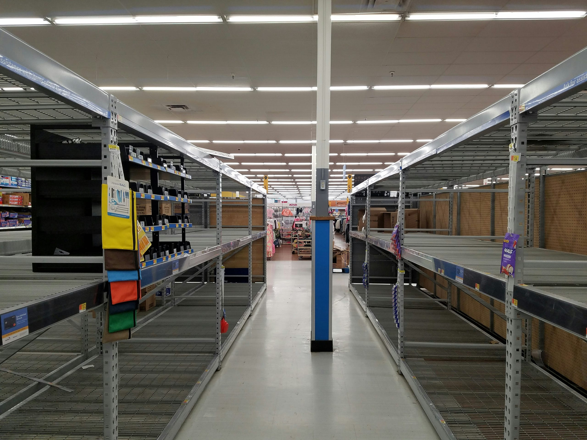

# Sell-Through Rate: The One Metric That Rules Them All

*Part 3 of "The Retail Data Playbook"*

---

Most data scientists who enter retail come armed with impressive forecasting models, gradient boosting pipelines, and a deep appreciation for RMSE. Then they sit in their first planning meeting and watch a seasoned merchandiser dismiss a beautifully engineered model with four words: *"But what's the STR?"*

Sell-Through Rate. It's the metric retail lives and dies by — and if you don't understand it deeply, you'll spend months building things nobody actually uses.



*Photo by [Simon Ray](https://unsplash.com/@simonbhray) on [Unsplash](https://unsplash.com/).*

---

## The Setup: TrendCo's Spring Collection

Let me show you why STR matters through a scenario I've seen play out (in various forms) at nearly every fashion retailer.

**TrendCo** is a mid-tier women's fashion brand with 120 stores across the UK. In October, their buying team placed orders for the Spring 2026 collection — 6 months before a single unit would hit the shop floor. In January, 18,000 units of their signature **Cleo Wrap Dress** arrived in the distribution center.

By late February, the planning team needs to make a critical decision: is the Cleo performing well enough to support a reorder, or should they start thinking about markdowns?

Here's what the weekly sell-through data looks like:

---

## The Weekly STR Story

**TrendCo — Cleo Wrap Dress (Spring 2026 Collection)**
*Total receipts: 18,000 units | Full price: £65 | Cost: £22*

| Week | Week Sales | Cumul. Sales | Inventory EOP | Cumul. STR | Notes |
|------|-----------|--------------|---------------|------------|-------|
| Wk 1 | 820 | 820 | 17,180 | 4.6% | Launch week |
| Wk 2 | 1,140 | 1,960 | 16,040 | 10.9% | Weekend traffic boost |
| Wk 3 | 1,050 | 3,010 | 14,990 | 16.7% | Steady |
| Wk 4 | 980 | 3,990 | 14,010 | 22.2% | End of month dip |
| Wk 5 | 1,210 | 5,200 | 12,800 | 28.9% | Instagram feature |
| Wk 6 | 1,380 | 6,580 | 11,420 | 36.6% | Good week |
| Wk 7 | 1,290 | 7,870 | 10,130 | 43.7% | ← Planning review |
| Wk 8 | 1,180 | 9,050 | 8,950 | 50.3% | |
| Wk 12 | — | 11,700 | 6,300 | 65.0% | Projected |
| Wk 16 | — | 13,500 | 4,500 | 75.0% | Projected (end of season) |

At Week 7, the planning team is staring at **43.7% STR**. The question: is that good or bad?

---

## What "43.7%" Actually Means

This is where most newcomers get lost. A number without a benchmark is just a number.

TrendCo's historical STR curves — built from 3 years of spring collections — show this:

**Historical Average STR Trajectory (Spring, Womenswear Dresses)**

| Week | Historical Avg STR | TrendCo Cleo (Current) | Status |
|------|--------------------|------------------------|--------|
| Wk 4 | 21.0% | 22.2% | On track |
| Wk 7 | 40.5% | 43.7% | Slightly ahead |
| Wk 10 | 58.0% | — (projected) | — |
| Wk 14 | 72.0% | — (projected) | — |
| Wk 20 | 84.0% | — (projected) | — |

The Cleo is at **43.7%** against a historical Week 7 average of **40.5%**. It's tracking about 8% ahead of curve. Using the historical curve projection formula:

```
Projected Final STR ≈ Current STR × (Historical Final STR / Historical Week 7 STR)
                    ≈ 43.7% × (84.0% / 40.5%)
                    ≈ 43.7% × 2.07
                    ≈ 90.5%
```

**The Cleo is on track to sell out.** Not just hit targets — sell out entirely. This changes the conversation from "should we markdown?" to "can we reorder?"

---

## The Benchmark Framework

Here's the STR interpretation grid every retail data scientist should internalize:

| STR Range at End of Season | Signal | Recommended Action |
|---------------------------|--------|--------------------|
| > 85% | Exceptional — demand exceeded supply | Evaluate rebuying; investigate stockout losses |
| 70–85% | Healthy sell-through | Normal operations; use as benchmark for future buying |
| 55–70% | Below expectations | Analyze root cause: price? wrong stores? style miss? |
| 40–55% | Weak — action required | Markdown candidate; transfer stock to top stores |
| < 40% | Poor performance | Urgent markdown; root cause review before next buy |

These ranges shift by category and retailer. A grocery retailer might consider 95%+ normal (you *really* don't want unsold fresh produce). A luxury fashion house might target 70% and treat higher as a sign they underestimated demand.

**The right benchmark is your own historical data, not an industry average.**

---

## The Dangerous Aggregation Trap

Here's a mistake I've seen repeatedly: a data scientist aggregates STR across sizes, sees 68%, and reports "the dress is performing well." The planning team moves on.

Six weeks later, chaos.

Look at the Cleo's size-level breakdown at Week 7:

**Cleo Wrap Dress — STR by Size at Week 7**

| Size | Receipts | Sold | Remaining | Size STR | Signal |
|------|---------|------|-----------|----------|--------|
| XS | 900 | 900 | 0 | **100%** | Sold out — lost sales |
| S | 2,700 | 2,700 | 0 | **100%** | Sold out — lost sales |
| M | 5,400 | 4,860 | 540 | 90.0% | Nearly gone |
| L | 5,400 | 2,430 | 2,970 | 45.0% | Slow |
| XL | 2,700 | 810 | 1,890 | 30.0% | Very slow |
| 2XL | 900 | 180 | 720 | 20.0% | Barely moving |
| **Total** | **18,000** | **11,880** | **6,120** | **66.0%** | Looks fine? |

The overall 66% STR looks acceptable. But the actual story is:

1. **XS and S are completely sold out.** Every customer who wanted a small Cleo in the last 3 weeks left empty-handed. That's lost revenue TrendCo will never recover.

2. **L, XL, and 2XL are accumulating dead weight.** These will likely need 30–40% markdowns to clear.

3. **The size curve was wrong.** TrendCo's buyers allocated inventory assuming a symmetric size distribution, but demand skewed heavily toward smaller sizes.

The real projected STR — if XS/S hadn't sold out — might have been 78–80%. Instead, they're heading toward 70% with distorted margins.

**This is why size-level STR is non-negotiable in fashion analytics.** Total STR is a headline number. Size-level STR is where the money is.

---

## The Adjusted STR: Separating Demand from Availability

When stock is missing for certain sizes, STR naturally slows — not because demand dried up, but because customers literally can't buy what they want. This creates a false signal.

The fix: **Adjusted STR**

```
Adjusted STR = Actual STR / Availability Rate
```

Where `Availability Rate` = the proportion of the assortment that's actually in stock (at size level, store level, or both).

For the Cleo at Week 7:
- XS and S are completely gone (2 of 6 sizes = 33% of sizes unavailable)
- A rough availability rate might be ~70% (weighted by size curve)
- Adjusted STR = 66.0% / 0.70 = **94.3%**

**The underlying demand is extremely strong.** The product isn't underperforming — it's undersupplied in the sizes people actually want.

This distinction matters enormously. A naive read sends the planner toward markdowns. The adjusted read points to a reorder (or at least, a reallocation of remaining stock).

---

## STR Velocity: Comparing Apples to Apples

Not all products enter the season at the same time. A new style launched at Week 6 has a 40% STR. Another style launched at Week 1 also has a 40% STR. Are they equally healthy?

Absolutely not. Use **STR velocity** to normalize for time on sale:

```
STR Velocity (% per week) = Cumulative STR / Weeks on Sale
```

**TrendCo Spring 2026 — STR Velocity Comparison at Week 10**

| Style | Launch Week | STR at Wk 10 | Weeks on Sale | STR Velocity | Projected Final |
|-------|-------------|-------------|---------------|--------------|-----------------|
| Cleo Wrap Dress | Wk 1 | 66.0% | 10 | **6.6%/wk** | ~85% ✓ |
| Iris Midi Skirt | Wk 1 | 40.0% | 10 | **4.0%/wk** | ~52% ✗ |
| Orla Blazer | Wk 4 | 42.0% | 6 | **7.0%/wk** | ~88% ✓ |
| Petra Jumpsuit | Wk 6 | 28.0% | 4 | **7.0%/wk** | ~88% ✓ |

The Iris Midi Skirt is the problem child — low velocity and low absolute STR. The Orla Blazer and Petra Jumpsuit look like weak performers on raw STR, but their velocity signals they're actually outperforming relative to their time on sale.

Without velocity, you might markdown the Orla (unnecessary) and ignore the Iris (mistake). With velocity, the markdown decision becomes obvious.

---

## What the Data Scientist's Job Actually Is

After living in retail data for a while, I'd describe the role this way: **the data scientist's job is not to compute STR — Excel can do that. The job is to build the infrastructure that surfaces the *right* STR to the *right* person at the *right* moment.**

In practice, that means:

**1. Build STR at every grain you might need**
- Style × week
- Style × size × week
- Style × store × week (for allocation decisions)
- Style × region × week (for transfer decisions)

**2. Compare against the right baseline**
- Historical curves by category, season, and tier
- Never average store STRs — always roll up from components

**3. Surface early warnings automatically**
- Size-level STR >90% in Week 4 → stockout alert
- Size-level STR <25% in Week 6 → markdown candidate flag
- Velocity below historical P25 → planner notification

**4. Adjust for broken assortments**
- Calculate availability rate alongside STR
- Report adjusted STR when availability drops below ~80%

**5. Project final STR from current position**
- Use historical curve ratios, not linear extrapolation
- Include confidence intervals (historical variance matters)

The moment a planner can glance at a dashboard and immediately know which styles need action — without digging through spreadsheets — you've delivered real value.

---

## Key Takeaways

- **STR = Units Sold / Units Received.** Simple formula, deep diagnostic power.
- **Benchmarks matter more than the number itself.** 60% STR on a style tracking 15% above historical curve is excellent. 60% STR on a style tracking 20% below curve is a problem.
- **Always compute STR at size level.** Aggregate STR masks the most expensive mistakes in fashion retail.
- **Adjusted STR separates demand signals from availability signals.** A product with low STR but low availability might have strong demand — don't markdown it, fix the stock.
- **STR velocity normalizes for time on sale.** Use it to compare products that launched at different points in the season.
- **Your job is the infrastructure, not the formula.** Build systems that surface the right STR to decision-makers before the window to act has closed.

---

## What's Next

In Part 4, I'll dig into what happens when an assortment "breaks" — when popular sizes sell out while others accumulate. **Brokenness** is one of the most expensive and misunderstood problems in fashion retail: it simultaneously destroys margin (unsold stock) and revenue (unmet demand in stockedout sizes).

We'll look at how to measure it, how to model its downstream impact on STR, and what data science can actually do about it.

---

*This post is part of "The Retail Data Playbook" — a series for data scientists and analysts building products for retail and e-commerce businesses.*

*All company names and data in this post are fictional and used for illustrative purposes.*
