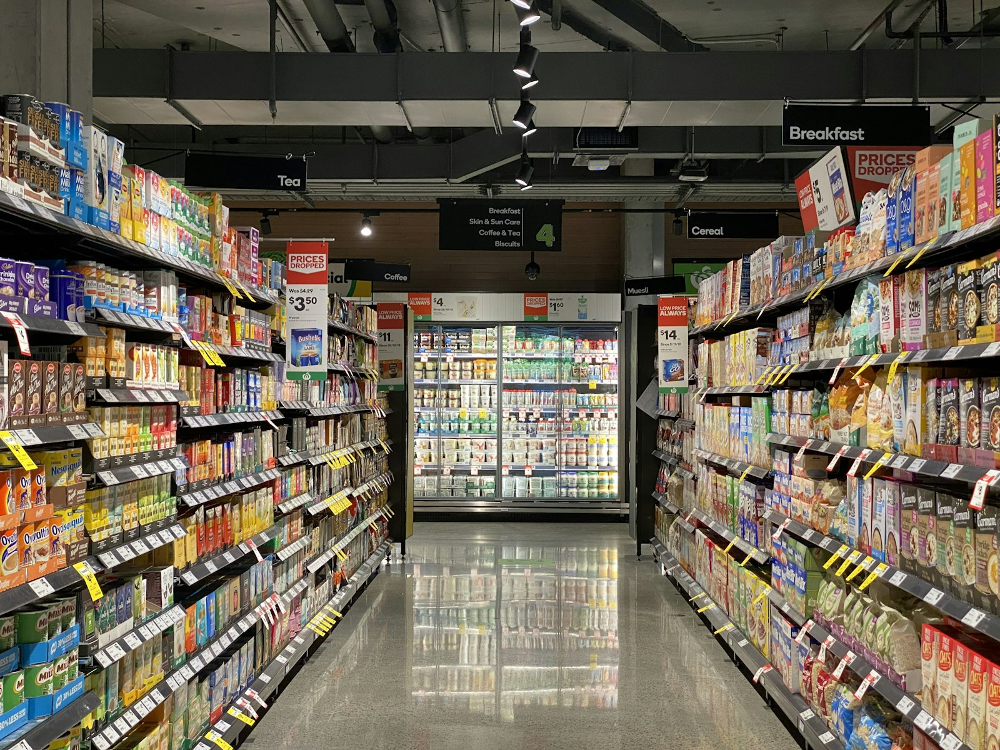

# Keeping Shelves Full Without Drowning in Stock: Store Replenishment

*Part 15 of "The Retail Data Playbook" — Season 2: Inside the Planning Machine*

---

The shelf says full. The system says full. The customer found nothing.

That sentence describes the single most expensive blind spot in grocery retail, and we'll get to it. But first, understand what world we've just walked into. The last three posts were about fashion — a finite pile of inventory, bet on months ahead, split once. **Store replenishment is the opposite world.** In grocery, nothing is a one-shot bet. The shelf empties every day and has to be refilled every day, forever, without either running dry (lost sales, walked customers) or drowning the store in stock (tied-up capital, spoiled fresh food).

Replenishment is the respiratory system of retail — the continuous cycle of counting what's on the shelf, calculating what's needed, and triggering the reorder. Do it well and it's invisible: shelves stay full, capital stays lean, waste stays low. Do it badly and it fails in two directions at once, and the global bill for getting it wrong — stockouts plus overstock combined — runs to roughly $1.8 trillion a year. This post is about how the engine works, and the silent failure mode that quietly poisons every replenishment model ever built.



*Photo by [Franki Chamaki](https://unsplash.com/@franki) on [Unsplash](https://unsplash.com/).*

---

## Two Ways to Refill a Shelf

There are fundamentally two replenishment philosophies, and the difference matters:

| | Periodic Replenishment | Continuous Replenishment |
|---|---|---|
| Order timing | Fixed intervals (every Monday, every month) | Triggered by real-time demand velocity |
| Runs on | Static tables, delayed history | Live POS, sensors, external signals |
| Response speed | Reacts days/weeks later | Reacts within hours |
| Stock profile | High safety stock, idle capacity | Lean, just-in-time |
| Best for | Stable, predictable, standard items | Volatile, trend-driven, perishable |

Older retail ran on periodic cycles — order the same things every Monday and hope. Modern grocery, squeezed by e-commerce and fresh-food waste, has moved to continuous replenishment: orders triggered by what's actually selling, right now. The order cycle that used to be four-to-seven days has compressed to as little as two. For fresh food, "reacting next Monday" means throwing away yogurt on Tuesday and running out on Saturday.

---

## The Two Dials: Reorder Point and Safety Stock

Continuous replenishment turns on two parameters. We met both in Season 1's [inventory post](/blog/inventory-optimization/); here's how they drive the *loop*:

- **Reorder Point (ROP)** — the stock level low enough that it will *just* cover demand during the lead time until the next delivery lands. Hit the ROP, trigger an order.

  ```
  ROP = (average daily demand × lead time in days) + safety stock
  ```

- **Safety Stock** — the buffer against the two things that go wrong: demand spikes above forecast, or deliveries arrive late. Modern systems don't hold it as a fixed number — they flex it per SKU based on how volatile that product's demand and lead time actually are.

**FreshMart — Reorder Point for Yogurt (one store)**

| Input | Value |
|---|---|
| Average daily demand | 42 units |
| Lead time | 2 days |
| Demand during lead time | 84 units |
| Safety stock (covers demand + delivery variability) | 40 units |
| **Reorder Point** | **124 units** |

When this store's yogurt stock drops to 124, the system fires an order — automatically, no human in the loop — sized to respect the supplier's case pack and minimum order quantity. Across 80 FreshMart stores and tens of thousands of SKUs, this runs continuously, untouched by human hands. Which is exactly why the next problem is so dangerous.

---

## The Silent Killer: Phantom Inventory

Here's the failure I opened with. The entire replenishment engine trusts one number: **how much stock the system thinks is on the shelf.** ROP logic is elegant, the forecast is sharp, the ordering is automatic — and all of it is downstream of a single input that is quietly, routinely *wrong*.

**Phantom inventory** is stock the system believes exists but that isn't actually sellable on the shelf. It comes from theft (shrinkage), mis-scans at the till, items misplaced in the backroom, damaged units never written off, or delivery errors. And it's catastrophic for one specific reason: **the ROP never triggers.** The system thinks there are 40 units, so stock never appears to hit the reorder point, so no order is ever placed — while the shelf sits empty and customers walk. It's a stockout the system cannot see.

**FreshMart — Phantom Inventory Across One Store's Dairy Aisle**

| SKU | System stock | Actual shelf | Phantom gap | vs. reorder point | What happens |
|---|---|---|---|---|---|
| Yogurt 500g | 138 | 138 | 0 | Genuinely above | Correct — no action needed |
| Oat Milk 1L | 96 | 12 | 84 | System reads above; shelf is below | **Silent stockout — no reorder fires** |
| Butter 250g | 61 | 61 | 0 | Genuinely above | Correct |
| Kefir 500ml | 44 | 0 | 44 | System reads above; shelf is empty | **Silent stockout — no reorder fires** |

The Oat Milk and Kefir are *out on the shelf* but *in stock in the system*. The replenishment engine, doing exactly what it was designed to do, orders nothing. Every hour those gaps persist is lost full-margin sales the dashboards will never flag — because on every report, availability looks fine. This is the same lesson as Season 1's [brokenness post](/blog/brokenness/) ("98% in stock" was a lie), but caused upstream, in the data layer, and it silently corrupts the training data for every forecast that learns from it.

The fixes are getting physical: IoT shelf sensors, computer-vision cameras, and staff photographing shelves with mobile apps to reconcile "theoretical stock" against "actual stock" in real time. But the first job of a replenishment data scientist is simply to *know phantom inventory exists* and hunt for it — because a perfect model on poisoned data is worse than useless; it's confidently wrong.

---

## One Number vs. a Distribution

Even with clean stock data, *how* you forecast demand splits replenishment into two eras.

**Deterministic** models (classic ARIMA/ETS) output a single number: "150 units next week." Fine for a stable staple with years of steady history. But they can't express uncertainty — and the moment a competitor promotes or a delivery slips, they either pile up overstock or run dry.

**Probabilistic** models output a *distribution*: "50% chance of 100 units, 15% chance of 80, 5% chance of 150." This is the unlock, because it lets you connect the inventory decision directly to the financial trade-off — the holding cost of one extra unit vs. the lost margin of a stockout — and set stock to whatever service level the business actually wants to pay for. It costs meaningfully more compute, but for volatile and perishable categories it pays for itself in waste avoided.

And not every SKU deserves the same treatment. **ABC analysis** sorts products by revenue impact: the "A" items (the vital few driving most revenue) get high service levels and tight monitoring; the "C" long-tail gets leaner, cheaper policies. You spend your forecasting effort — and your safety stock — where the money is.

---

## The Scenario: FreshMart's Fresh-Food Squeeze

FreshMart's hardest replenishment problem is fresh, because fresh punishes you in *both* directions harder than anything else. Order too little and you stock out of a daily staple (customers do a full shop elsewhere — the lost sale isn't one item, it's the basket). Order too much and it spoils — a 100% loss, not a markdown.

Consider two policies on the same fresh-berries SKU:

**FreshMart — Fresh Berries, Periodic vs Continuous (one store, one week)**

| Metric | Periodic (weekly order) | Continuous (demand-sensed daily) |
|---|---|---|
| Avg on-hand | 210 units | 95 units |
| Stockout days | 2 | 0 |
| Units spoiled | 48 | 6 |
| Lost-sale baskets | ~35 | ~4 |

Same product, same demand — the continuous, demand-sensed policy holds less than half the stock, spoils a fraction as much, *and* stocks out less. That's not a trade-off; it's a strict improvement, and it's the entire reason grocery has moved to continuous replenishment. The one thing that would break it? Phantom inventory feeding the demand-sensing engine bad shelf data.

---

## What the Data Scientist Actually Builds

1. **A phantom-inventory detector.** The highest-value thing on this list. Flag SKUs where system stock says "fine" but sales have flatlined against forecast — the signature of a shelf that's empty while the system thinks it's full. Reconcile against sensor/vision/manual counts. Everything downstream depends on this being right.

2. **Demand sensing, not just demand planning.** Short-horizon re-forecasting on live POS plus external signals (weather, local events, search trends) for the volatile and fresh categories where last week's average is useless.

3. **Dynamic ROP and safety stock.** Stop treating them as static fields. Recompute per SKU from its actual demand and lead-time distributions, and tune to the ABC service-level tier.

4. **Probabilistic forecasts tied to a cost function.** Output distributions, not points, and let the inventory decision optimize holding cost vs. stockout cost at the service level the business chose.

5. **Autonomous ordering with guardrails.** Generate the POs automatically — respecting MOQ, case packs, and shelf capacity — but surface the exceptions (phantom-inventory alerts, forecast breaks, supplier delays) for humans to resolve.

The recurring theme of this series holds here too: the model's output isn't a forecast, it's a *filled shelf* — and the fastest way to a filled shelf is often not a better forecast but a truer view of what's actually on the shelf right now.

---

## Key Takeaways

- **Replenishment is the opposite of allocation.** Not a finite one-shot bet — a continuous, forever cycle of refilling shelves without running dry or drowning in stock.
- **Continuous beats periodic for volatile and fresh categories.** It holds less stock, wastes less, *and* stocks out less — a strict win, not a trade-off.
- **ROP and safety stock are the two dials.** Hit the reorder point, fire the order. Modern systems flex both per SKU instead of freezing them as static numbers.
- **Phantom inventory is the silent killer.** When system stock is wrong-high, the ROP never triggers and the shelf stays empty while every report says "in stock." Hunt it before you trust any forecast.
- **Forecast distributions, not points.** Probabilistic models let you price the stockout-vs-holding trade-off and set stock to the service level you're willing to pay for.
- **Spend effort where the money is.** ABC analysis: high service on the vital few, lean policies on the long tail.

---

## What's Next

Replenishment refills the shelf from the warehouse. But sometimes the stock you need isn't in the warehouse at all — it's already inside your company, sitting in the wrong store. In Part 16 we look at **[store-to-store transfers](/blog/store-transfers/)**: the arbitrage hiding in your network, when a transfer beats a markdown, why total landed cost decides the whole thing, and how rising transfer volume is really a report card on how badly you allocated in the first place.

---

*"The Retail Data Playbook" is a series for data scientists and analysts building products for retail and e-commerce businesses. Season 2 goes inside the operating machine of a retailer.*

*All company names and data in this post are fictional and used for illustrative purposes.*
